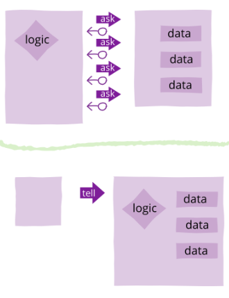

# Notes during discussion with @Froi

### ***Date: July 25, 2022***

## Programming terms and concepts:
1. Coupling - "dependency of class to each other" || "Coupling is nothing but the dependency of one class on the other. If one object in a code uses the other object in the program, it is called loose coupling in Java. In coupling, two classes or objects collaborate and work with each other to complete a pre-defined task"
    * degree of direct knowledge that one element has of another
    * tightly coupled components are dependent on each other and highly sensitive to change between each other.

2. Cohesion - "keeping related things close together" || "Cohesion is closely related to ensuring that the purpose for which a class is getting created in Java is well-focused and single. In other words, the more closely related stuff is grouped in a class, the higher will be the cohesiveness."

## Programming principles:
1. YAGNI - "You Aren't Gonna Need It"
    - Don't add code or feature that is not needed.
    - This will lead to less code and less complex features overall.
    - **Test Driven Development (TDD)** works hand in hand with this, it helps you follow **YAGNI**.
2. KISS - "Keep It Simple Stupid"
3. **"Tell, Don't Ask"**
    - Logic of methods should be abstracted together wuth the class that holds the data.
    

4. DRY - "Don't Repeat Yourself"
    - Reducing repetetion. This applies to code, logic, configuration, etc.
    - This will lead to less code and, if done right, less bugs as well.
    - Easier to manage code, since you won't need to repeatedly update code in multiple places.
    - **DRY is not FREE** - it comes with the cost of coupling. The more you reuse the code, the more tighly coupled your code becomes. Only reuse code that have the same reason to change.

## Tips and practice for IDEAL CODE:
1. "Code should have HIGH COHESION and LESS COUPLING" - DRY means having a single authoritative source of truth.

    The cost for DRY is "COUPLING" -> use DELEGATION APPROACH
    "The more DRY you are, the more you are highly COUPLED"
    To avoid more coupling, use: "COMPOSITION APPROACH"

    ### **HIGH COHESION and LOW COUPLING**
    - This is the ideal state of things.
    - This will alllow components/classes to change with minimal impact to others.
    - This also means code is easier to read since related things are in one place.

2. "Implementation Inheritance is bad" || "Interface inheritance is good"
3. "Interface is a contract" 
4. RED > GREEN > REFACTOR (TDD related approach)
5. Dependency Injection:
    * Adds more FLEXIBILITY to the code.
    * Increases code complexity.
6. Law of DEMETER - principle of least knowledge || "You don't know the internal parts"

---
## Inheritance
- There are two types of inheritance: **Interface Inheritance** and **Implementation Inheritance**.
### Implementation Inheritance
- Parent class method implementation is used by the Child class.
- The reason for inheritance is usually rooted on having code reusability.
- **AVOID** using Implementation Inheritance.
- Whenever you have an urge to reuse code via inheritance, use **Composition/Delegation** instead.

## Composition in Java:
The composition is a design technique in java to implement a has-a relationship. Java Inheritance is used for code reuse purposes and the same we can do by using composition. The composition is achieved by using an instance variable that refers to other objects. If an object contains the other object and the contained object cannot exist without the existence of that object, then it is called composition. In more specific words composition is a way of describing reference between two or more classes using instance variable and an instance should be created before it is used. 

# IntelliJ IDEA shortcut keys and tips:
1. ctrl + D = duplicate
2. ctrl + Y = delete line
3. @Deprecated - anotation that warns the coder that a block of code has already been deprecated
4. 